# ABook Player Project

[](file:///c:/Users/olexa/Documents/MayDev/ABookPlayer/ABookPlayer/CHANGELOG.md)
[](file:///c:/Users/olexa/Documents/MayDev/ABookPlayer/PROJECT_HISTORY.md)
[](file:///c:/Users/olexa/Documents/MayDev/ABookPlayer/ABookPlayer/app/build.gradle.kts)
[](file:///c:/Users/olexa/Documents/MayDev/ABookPlayer/LICENSE)
[](file:///c:/Users/olexa/Documents/MayDev/ABookPlayer/metadata/de.f_soft_studio.abookplayer.yml)

Willkommen beim **ABook Player** Projekt-Repository!

Dieses Repository enthält die native Android-App zur Wiedergabe von Hörbüchern im **.abook**-Containerformat sowie herkömmlicher Ordner-Sammlungen, zusammen mit der vollständigen, konsolidierten Projektdokumentation.

---

## 🚀 Key Features (Release 2.0.0)

- 🎧 **Media3 ExoPlayer & Android Auto:** Nahtlose Hintergrund-Wiedergabe, Automotive-Integration, variabler Speed (0.75x–2.0x), präzises Seeking & Smart Rewind.
- 🔍 **Online Metadaten- & Cover-Suche:** Integrierte Suche via Audible (DE) und iTunes mit interaktiver Trefferauswahl und HD-Cover-Vorschau.
- 📦 **.abook Container & SAF:** Import & Export von `.abook`-Dateien (ZIP mit `manifest.json`, Cover & Audio) mit Schutz vor Zip-Slip.
- 📁 **Smarter Ordner-Scanner & Dynamische Kapitel-Erkennung:** Automatische CD1/CD2 Unterordner-Zusammenführung, Duplikaterkennung & on-the-fly Playlist-Generierung.
- 🛡️ **Robuste Datenbank-Architektur:** Room-Datenbank mit Kaskadenschutz gegen unabsichtlichen Datenverlust.
- 🚗 **Car Mode:** Spezieller Fahrmodus mit riesigen Schaltflächen für ablenkungsfreie Bedienung im Auto.
- 🌙 **OLED True Black Theme & Paper Look:** Warmes Bibliotheks-Design & stromsparendes Reinschwarz-Design (#000000) für den Player.
- ⏰ **Sleep Timer & Shake to Extend:** Abschalttimer (inkl. am Kapitelende) & Schütteln zum Verlängern (+15 Min.).
- 📊 **Lokale Hörstatistiken:** Tägliche/wöchentliche Auswertung & Streaks (100% datenschutzfreundlich, offline).
- 📚 **Serien- & Sprecher-Verwaltung:** Buchreihen-Sortierung, Sprecher-Suche, Metadaten-Editor.
- ⚡ **Homescreen Widget, Skip Silence & FLAC Support:** Widgets, Stille überspringen, FLAC/MP3/M4A/AAC/OGG-Support & Mehrsprachigkeit (DE/EN).

---

## 📸 Screenshots & Benutzeroberfläche

| Bibliothek (Listenansicht) | Bibliothek (Rasteransicht) | OLED Audioplayer | Kapitelübersicht |
| :---: | :---: | :---: | :---: |
| 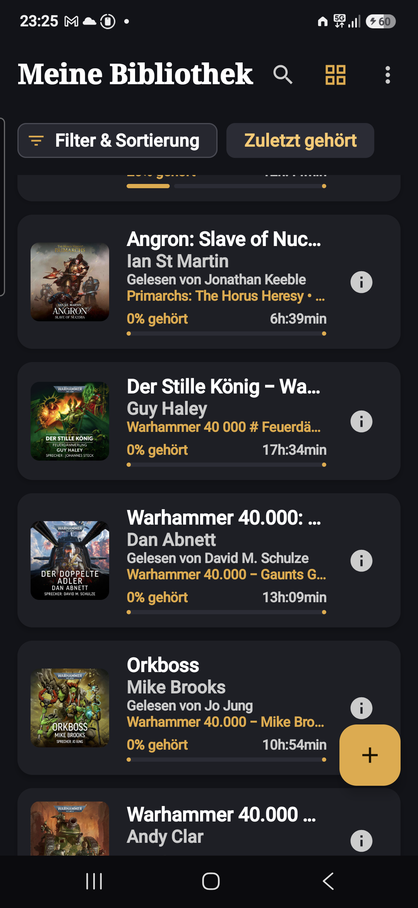 | 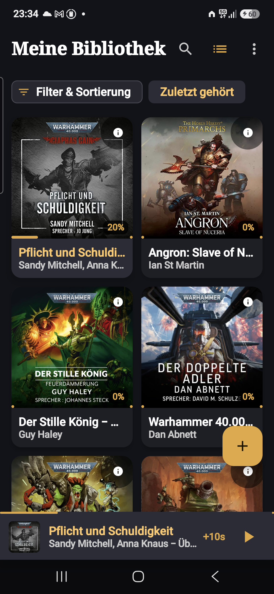 | 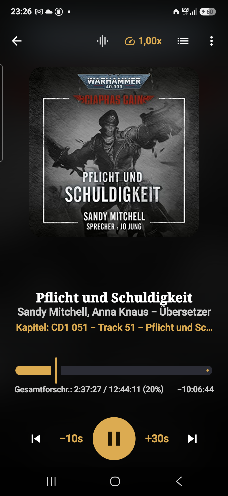 | 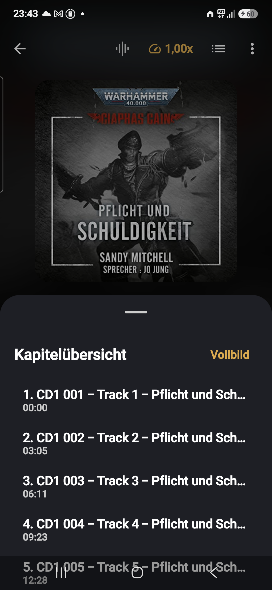 |
| *Listenansicht mit Mini-Player* | *2-Spalten-Raster mit Cover-Art* | *Reinschwarz (#000000) Stage* | *Live-Wellenform am aktiven Track* |

| Sound & Equalizer | Wiedergabetempo | Player-Menü | Hörbuch-Details |
| :---: | :---: | :---: | :---: |
| 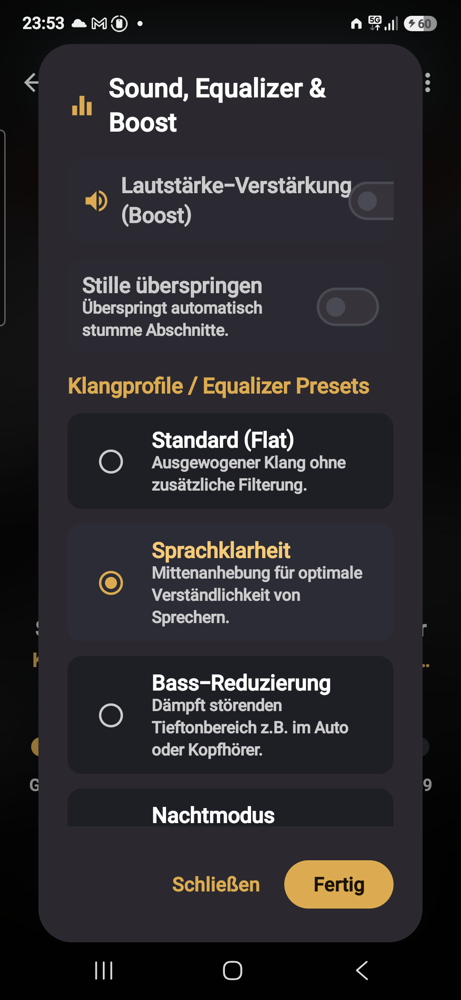 | 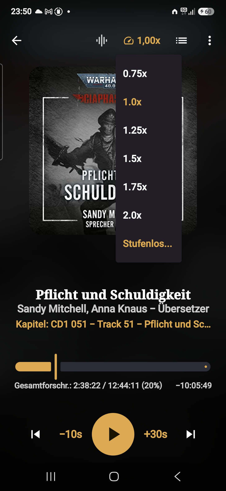 | 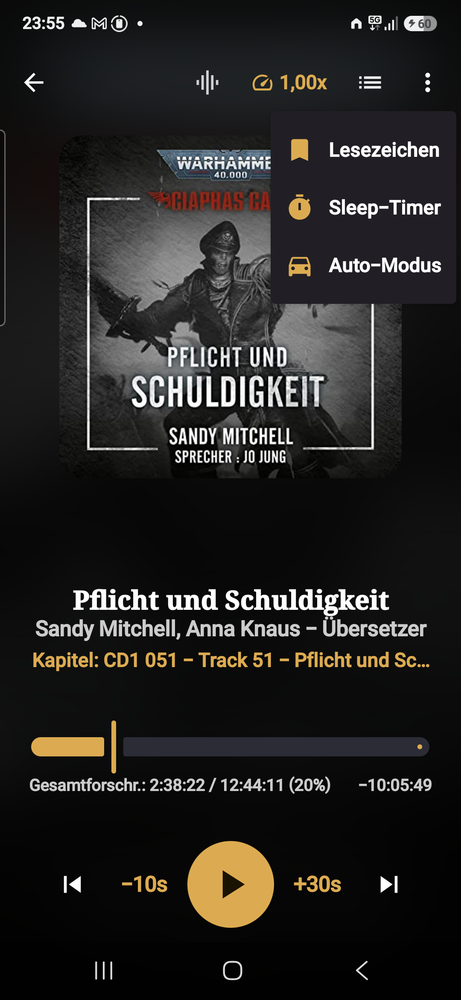 | 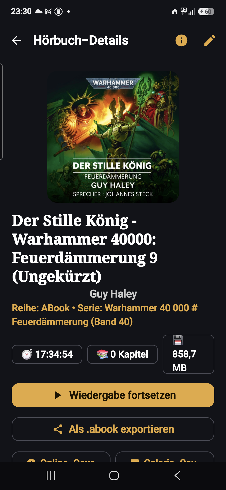 |
| *Boost, Stille überspringen & Presets* | *0.75x–2.0x & Stufenlos* | *Sleep-Timer, Lesezeichen & Auto* | *Metadaten, Figuren & Export* |

| Online-Metadatensuche | Metadaten-Editor | Technische Spezifikationen |
| :---: | :---: | :---: |
| 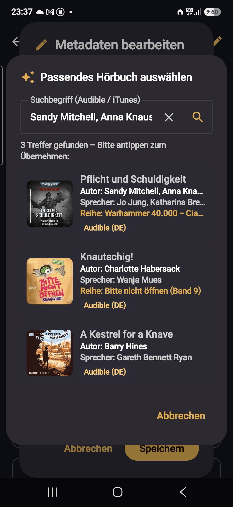 | 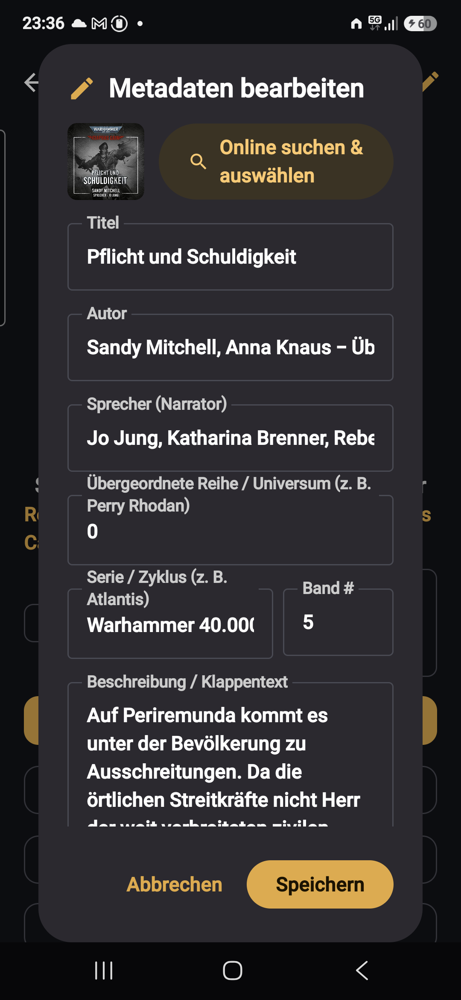 | 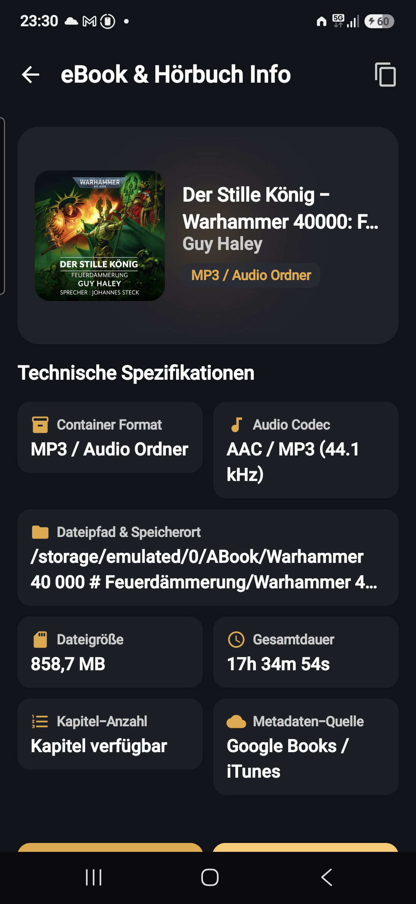 |
| *Audible & iTunes Live-Suche* | *Reihen-, Band- & Sprecher-Editor* | *.abook Container & Audio-Encoding* |

---


## 📚 Offizielle Projektdokumentation

Die aktuelle und verbindliche Projektdokumentation befindet sich im Ordner [**docs/**](file:///c:/Users/olexa/Documents/MayDev/ABookPlayer/docs/README.md):

- 📖 [**Dokumentations-Hauptseite (docs/README.md)**](file:///c:/Users/olexa/Documents/MayDev/ABookPlayer/docs/README.md) – Übersicht aller 17 Kapitel.
- 📐 [**04_architektur.md**](file:///c:/Users/olexa/Documents/MayDev/ABookPlayer/docs/04_architektur.md) – Clean Architecture & Schichtenmodell.
- 🗄️ [**06_datenmodell.md**](file:///c:/Users/olexa/Documents/MayDev/ABookPlayer/docs/06_datenmodell.md) – Room-Datenbank, Entitäten und Migrationen.
- 📦 [**08_spezifikation-des-abook-formats.md**](file:///c:/Users/olexa/Documents/MayDev/ABookPlayer/docs/08_spezifikation-des-abook-formats.md) – Spezifikation des `.abook`-Containerformats.
- 🎵 [**09_audio-wiedergabe.md**](file:///c:/Users/olexa/Documents/MayDev/ABookPlayer/docs/09_audio-wiedergabe.md) – Media3 ExoPlayer Engine & Foreground Service.
- 🧪 [**12_teststrategie-und-qualitaetssicherung.md**](file:///c:/Users/olexa/Documents/MayDev/ABookPlayer/docs/12_teststrategie-und-qualitaetssicherung.md) – Testkonzept & Qualitätssicherung.

---

## 📂 Repository-Struktur

- 📱 [**ABookPlayer/**](file:///c:/Users/olexa/Documents/MayDev/ABookPlayer/ABookPlayer/README.md)  
  Das vollständige Kotlin Android-Projekt (Jetpack Compose, Media3 ExoPlayer, Room, Clean Architecture).
- 📚 [**docs/**](file:///c:/Users/olexa/Documents/MayDev/ABookPlayer/docs/README.md)  
  Die konsolidierte Projektdokumentation (Kapitel 01 bis 17).
- 📋 [**PROJECT_HISTORY.md**](file:///c:/Users/olexa/Documents/MayDev/ABookPlayer/PROJECT_HISTORY.md)  
  Vollständige Chronologie und Nachweis aller abgeschlossenen Phasen (Phase 0 bis 15).
- 📐 [**ABook_Player_Antigravity_Plan/**](file:///c:/Users/olexa/Documents/MayDev/ABookPlayer/ABook_Player_Antigravity_Plan/)  
  Spezifikationen, UI-Prototypen und Architektur-Richtlinien.

---

## 🛠️ Build & Installation

Zum Bauen der Android Application (Release 1.1.0):

```bash
cd ABookPlayer
# Tests ausführen
.\gradlew.bat test

# Debug APK erstellen
.\gradlew.bat assembleDebug

# Release APK erstellen
.\gradlew.bat assembleRelease
```

---

## 📊 Aktueller Status

- **Entwicklungsstand:** 🎉 **100% abgeschlossen (Release 2.0.0 / Phasen 0–24)**
- **Build-Ergebnis:** 🟢 `BUILD SUCCESSFUL` (Debug & Release APKs)
- **Test-Ergebnis:** 🟢 Alle 53 Unit-, ViewModel-, Storage-, Service- & DAO-Tests bestanden

---

## 🌐 Git-Veröffentlichung & GitHub-Upload

Das Projekt kann automatisiert zu [**github.com/LexAD66/ABookPlayer**](https://github.com/LexAD66/ABookPlayer) hochgeladen werden:

### Option A: Automatisches Upload-Skript (Empfohlen)
Einfach die Datei **`upload_github.bat`** per Doppelklick starten oder in PowerShell ausführen:
```powershell
.\upload_github.ps1
```
*Das Skript führt automatisch die Vorprüfungen durch, bindet das Remote `origin` an `https://github.com/LexAD66/ABookPlayer.git`, staged & committet alle Änderungen, erstellt das Release-Tag `v2.0.0` und pusht den Branch `main` samt Tags zu GitHub.*

### Option B: Manuell über die Git-Befehlszeile
```bash
# Remote anbinden
git remote add origin https://github.com/LexAD66/ABookPlayer.git

# Hauptbranch auf 'main' setzen
git branch -M main

# Änderungen committen und pushen
git add .
git commit -m "Release 2.0.0: Major stable release"
git tag -a v2.0.0 -m "Release v2.0.0: ABook Player"
git push -u origin main --tags
```
